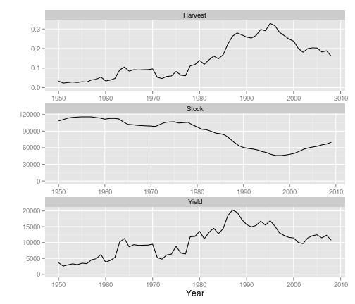

Testing management statistics in \code{mng}
========================================================


```r
library(biodyn)
library(aspic)

data(bd)
```


```r
plot(bd)
```

 


```r
bd@mng
```

```
## An object of class "FLPars"
## [[1]]
## An object of class "FLPar"
## params
##        logr        logk     logq[1]     logs[1]           r           k 
## -8.0158e-01  1.1728e+01 -5.9492e+00 -1.4374e+00  4.4862e-01  1.2406e+05 
##           a           p           q           s          B2       BBMSY 
##  8.7500e-01  1.0000e+00  2.6080e-03  2.3754e-01  6.5255e+04  1.0520e+00 
##       HHMSY 
##  3.3667e+00 
## units:  NA 
## 
## [[2]]
## An object of class "FLPar"
##          params
## params    logr        logk        logq[1]     logs[1]     r          
##   logr     5.5159e-02 -4.6845e-02  4.9292e-02  0.0000e+00  2.4747e-02
##   logk    -4.6845e-02  3.9872e-02 -4.2247e-02  0.0000e+00 -2.1017e-02
##   logq[1]  4.9292e-02 -4.2247e-02  4.7137e-02  0.0000e+00  2.2115e-02
##   logs[1]  0.0000e+00  0.0000e+00  0.0000e+00  1.1905e-02  0.0000e+00
##   r        2.4747e-02 -2.1017e-02  2.2115e-02  0.0000e+00  1.1103e-02
##   k       -5.8116e+03  4.9465e+03 -5.2411e+03  0.0000e+00 -2.6074e+03
##   a        0.0000e+00  0.0000e+00  0.0000e+00  0.0000e+00  0.0000e+00
##   p        0.0000e+00  0.0000e+00  0.0000e+00  0.0000e+00  0.0000e+00
##   q        1.2855e-04 -1.1018e-04  1.2293e-04  0.0000e+00  5.7676e-05
##   s        0.0000e+00  0.0000e+00  0.0000e+00  2.8279e-03  0.0000e+00
##   B2      -2.0695e+03  1.8212e+03 -2.1376e+03  0.0000e+00 -9.2850e+02
##   BBMSY    1.5923e-02 -1.2585e-02  9.9835e-03  0.0000e+00  7.1438e-03
##   HHMSY   -7.8941e-02  6.3763e-02 -5.5661e-02  0.0000e+00 -3.5417e-02
##          params
## params    k           a           p           q           s          
##   logr    -5.8116e+03  0.0000e+00  0.0000e+00  1.2855e-04  0.0000e+00
##   logk     4.9465e+03  0.0000e+00  0.0000e+00 -1.1018e-04  0.0000e+00
##   logq[1] -5.2411e+03  0.0000e+00  0.0000e+00  1.2293e-04  0.0000e+00
##   logs[1]  0.0000e+00  0.0000e+00  0.0000e+00  0.0000e+00  2.8279e-03
##   r       -2.6074e+03  0.0000e+00  0.0000e+00  5.7676e-05  0.0000e+00
##   k        6.1365e+08  0.0000e+00  0.0000e+00 -1.3669e+01  0.0000e+00
##   a        0.0000e+00  0.0000e+00  0.0000e+00  0.0000e+00  0.0000e+00
##   p        0.0000e+00  0.0000e+00  0.0000e+00  0.0000e+00  0.0000e+00
##   q       -1.3669e+01  0.0000e+00  0.0000e+00  3.2061e-07  0.0000e+00
##   s        0.0000e+00  0.0000e+00  0.0000e+00  0.0000e+00  6.7174e-04
##   B2       2.2594e+08  0.0000e+00  0.0000e+00 -5.5749e+00  0.0000e+00
##   BBMSY   -1.5612e+03  0.0000e+00  0.0000e+00  2.6037e-05  0.0000e+00
##   HHMSY    7.9104e+03  0.0000e+00  0.0000e+00 -1.4516e-04  0.0000e+00
##          params
## params    B2          BBMSY       HHMSY      
##   logr    -2.0695e+03  1.5923e-02 -7.8941e-02
##   logk     1.8212e+03 -1.2585e-02  6.3763e-02
##   logq[1] -2.1376e+03  9.9835e-03 -5.5661e-02
##   logs[1]  0.0000e+00  0.0000e+00  0.0000e+00
##   r       -9.2850e+02  7.1438e-03 -3.5417e-02
##   k        2.2594e+08 -1.5612e+03  7.9104e+03
##   a        0.0000e+00  0.0000e+00  0.0000e+00
##   p        0.0000e+00  0.0000e+00  0.0000e+00
##   q       -5.5749e+00  2.6037e-05 -1.4516e-04
##   s        0.0000e+00  0.0000e+00  0.0000e+00
##   B2       1.2524e+08  1.0300e+02  5.0621e+02
##   BBMSY    1.0300e+02  1.4901e-02 -5.8916e-02
##   HHMSY    5.0621e+02 -5.8916e-02  2.3965e-01
## units:  NA 
## 
## Slot "names":
## [1] "hat"  "vcov"
## 
## Slot "desc":
## character(0)
## 
## Slot "lock":
## [1] FALSE
```


 

