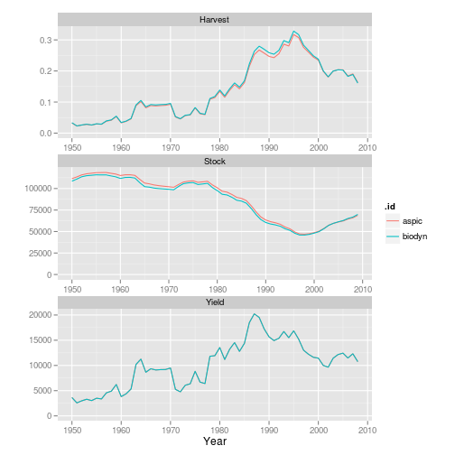

Testing pella
========================================================


```r
library(biodyn)
```

```
## Loading required package: FLCore
```

```
## Loading required package: grid
```

```
## Loading required package: lattice
```

```
## Loading required package: MASS
```

```
## FLCore 2.5.0 development version
```

```
## Attaching package: 'FLCore'
```

```
## The following object(s) are masked from 'package:base':
## 
## cbind, rbind
```

```
## Loading required package: FLash
```

```
## Loading required package: FLAdvice
```

```
## Loading required package: akima
```

```
## Loading required package: ggplotFL
```

```
## Loading required package: ggplot2
```

```
## Attaching package: 'ggplot2'
```

```
## The following object(s) are masked from 'package:FLCore':
## 
## %+%
```

```
## Attaching package: 'ggplotFL'
```

```
## The following object(s) are masked from 'package:FLCore':
## 
## catchSel
```

```
## Loading required package: FLAssess
```

```
## Warning: replacing previous import 'catchSel' when loading 'ggplotFL'
```

```
## Warning: replacing previous import 'ssn' when loading 'ggplotFL'
```

```
## Loading required package: kobe
```

```
## Loading required package: reshape
```

```
## Loading required package: plyr
```

```
## Attaching package: 'plyr'
```

```
## The following object(s) are masked from 'package:FLCore':
## 
## desc
```

```
## Attaching package: 'reshape'
```

```
## The following object(s) are masked from 'package:plyr':
## 
## rename, round_any
```

```
## The following object(s) are masked from 'package:FLCore':
## 
## expand
```

```
## Loading required package: coda
```

```
## Loading required package: emdbook
```

```
## Loading required package: tables
```

```
## Loading required package: Hmisc
```

```
## Loading required package: survival
```

```
## Loading required package: splines
```

```
## Hmisc library by Frank E Harrell Jr
## 
## Type library(help='Hmisc'), ?Overview, or ?Hmisc.Overview') to see overall
## documentation.
## 
## NOTE:Hmisc no longer redefines [.factor to drop unused levels when
## subsetting.  To get the old behavior of Hmisc type dropUnusedLevels().
```

```
## Attaching package: 'Hmisc'
```

```
## The following object(s) are masked from 'package:survival':
## 
## untangle.specials
```

```
## The following object(s) are masked from 'package:plyr':
## 
## is.discrete, summarize
```

```
## The following object(s) are masked from 'package:FLCore':
## 
## combine, units
```

```
## The following object(s) are masked from 'package:base':
## 
## format.pval, round.POSIXt, trunc.POSIXt, units
```

```
## Loading required package: LaF
```

```
## Loading required package: Rcpp
```

```
## Loading required package: RCurl
```

```
## Loading required package: bitops
```

```
## Loading required package: ellipse
```

```
## Attaching package: 'kobe'
```

```
## The following object(s) are masked from 'package:ggplotFL':
## 
## theme_ms
```

```
## Loading required package: cpue
```

```
## Loading required package: stringr
```

```
## Loading required package: r4ss
```

```
## Loading required package: tcltk
```

```
## Loading Tcl/Tk interface ...
```

```
## done
```

```
## Loading required package: gtools
```

```
## Loading required package: cluster
```

```
## Attaching package: 'cpue'
```

```
## The following object(s) are masked from 'package:ggplotFL':
## 
## decade, minMax, moments, stdz
```

```
## Attaching package: 'biodyn'
```

```
## The following object(s) are masked from 'package:FLAdvice':
## 
## hcr, msy
```

```r
library(aspic)
```


ASPIC

```r
asp = aspic("/home/laurie/Desktop/gcode/gbyp-sam/data/ASPIC/swon/2009/lowProd/aspic.inp")
asp = fit(asp)
```


pella-ADMB

```r
data(swonIndex)

pars = rbind(r = FLPar(r = 4 * params(asp)["msy"]/params(asp)["k"], p = 1), 
    params(asp)[c("k", "b0")])
bd = biodyn("pellat", params = pars, catch = catch(asp))
setParams(bd) <- swonIndex
setControl(bd) <- params(bd)

# fix b0 and the shape parameter
control(bd)[c("b0", "p"), "phase"] = -1

# fit
bd = pella(bd, swonIndex)

plot(biodyns(biodyn = bd, aspic = as(asp, "biodyn")))
```

 


```r
pars = rbind(r = FLPar(r = 4 * params(asp[["det"]])["msy"]/params(asp[["det"]])["k"], 
    p = 1), params(asp[["det"]])[c("k", "b0")])
```

```
## Error: error in evaluating the argument 'object' in selecting a method for
## function 'params': Error in UseMethod("determinant") : no applicable
## method for 'determinant' applied to an object of class "c('aspic',
## 'biodyn', 'FLComp')" Calls: [[ -> [[ -> .local -> do.call -> det ->
## determinant
```

```r
swon = biodyn("pellat", params = pars, catch = catch(asp[["det"]]))
```

```
## Error: error in evaluating the argument 'object' in selecting a method for
## function 'catch': Error in UseMethod("determinant") : no applicable method
## for 'determinant' applied to an object of class "c('aspic', 'biodyn',
## 'FLComp')" Calls: [[ -> [[ -> .local -> do.call -> det -> determinant
```

```r

setParams(swon) <- FLQuants(`1` = swonIndex, `2` = swonIndex)
```

```
## Error: object 'swon' not found
```

```r
setControl(swon) <- params(swon)
```

```
## Error: error in evaluating the argument 'object' in selecting a method for
## function 'params': Error: object 'swon' not found
```

```r
control(swon)[c("b0", "p", "sigma"), "phase"] = -1
```

```
## Error: object 'swon' not found
```

```r
swon = pella(list(swon, FLQuants(`1` = swonIndex, `2` = swonIndex)))
```

```
## Error: error in evaluating the argument 'object' in selecting a method for
## function 'pella': Error: object 'swon' not found
```

```r
plot(biodyns(biodyn = swon, aspic = as(asp[["det"]], "biodyn")))
```

```
## Error: error in evaluating the argument 'x' in selecting a method for
## function 'plot': Error in biodyns(biodyn = swon, aspic = as(asp[["det"]],
## "biodyn")) : object 'swon' not found Calls: biodyns -> biodyns
```


```r
t. = pella(list(bd[[1]], swonIndex), cmdOps = c("-mcmc 100000, -mcsave 100"))
```

```
## Error: error in evaluating the argument 'object' in selecting a method for
## function 'pella': Error in bd[[1]] : this S4 class is not subsettable
```

```r
plot(stock(t.)[, "2008"]/bmsy(t.), harvest(t.)[, "2008"]/fmsy(t.))
```

```
## Error: error in evaluating the argument 'x' in selecting a method for
## function 'plot': Error in stock(t.) : error in evaluating the argument
## 'object' in selecting a method for function 'stock': Error: object 't.'
## not found
```

```r

plot(t.) + coord_cartesian(xlim = c(1970, 2010))
```

```
## Error: error in evaluating the argument 'x' in selecting a method for
## function 'plot': Error: object 't.' not found
```


